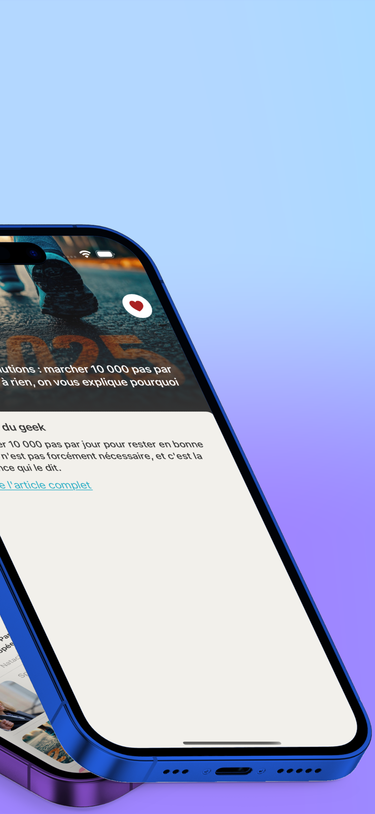

# InstantNews
|  |  |  |  |  |
|---|---|---|---|---|

InstantNews is a basic application where you can see the most recent news in 5 categories: Sports, Business, Entertainment, Science, Technology.

## Architecture
For this application I wanted to use the MVVM architecture with the Clean's principles.
I won't go deep into it but to clarify there are three main blocks:
- DataLayer: with the Network files and Repositories.
- Domain: with the Entities (models) and the UseCases for the business logic.
- Presentation: with the Views and ViewModels.

The flow is like that: Network -> Repository -> UseCases + Entities -> ViewModels -> Views.
It might be overkilled to use this kind of architecture for a simple app like that but in case of a future evolution it can be a good choice. It was also a personnal wish to understand it and try its implementation.

## Structure
The application has two tabs:
- The first one `NewsView.swift` displays one of the most recent news for each type and also the the list of the news fetched. It's possible to sort the news according to the chosen theme and paging is available to load the news faster and in a smarter way.
When a news is tapped, `NewsDetailsView.swift` is displayed to show the news information with a clickable button allowing us to see the complete article on the browser.
A favorite button (the heart one) is also there to let you save the desired news as favorite using UserDefaults.
- The second one `FavoriteView`, is a simple list where you can see your favorites articles and delete them at will.

## Tests
UnitTests created via Swift Testing, with mock files to simulate tests related to API calls.

## Summary of key features:
- Architecture: MVVM+C. Used framework: SwiftUI
- Custom TabBar.
- Reusable views in the CustomViews folder.
- Placeholder logic with the Shimmer library for a smoother UI/UX. Same with the Haptics (It's too satisfying).
- Kingfisher library used for the pictures.
- Favorite articles saved via UserDefaults for the possiblity the read it without any Wifi.
