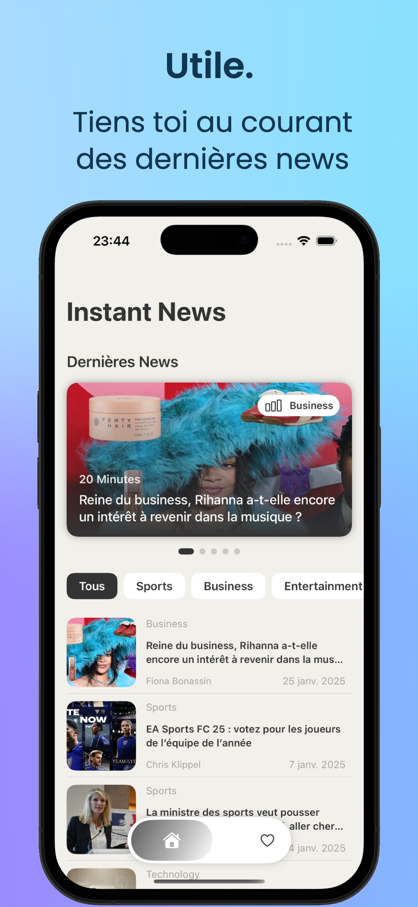

# InstantNews
|  |  |  |  |  |
|---|---|---|---|---|

## Faux départ
Après la prise de connaissance du projet, je me suis posé la question, *"Quelle application j'aimerai avoir pour lire des news"*. Quand on apprend l'histoire à l'école, on apprend principalement l'histoire de notre pays. C'est plus général quand on voit passer des news, mais c'est pas vraiment ciblé pour un pays non plus excepté le notre. J'ai donc voulu créer en premier plan, l'application *CountryNews*, dans l'idée de passer le pays désiré en paramètre et voir les news associées.

Malheureusement, après implémentation, je me suis rendu compte que pour l'endpoint `top-headlines` le paramètre `country` avait pour seule option `us`.

## Changement de plan
Suppression du projet *CountryNews* et création de *Instant News* ! J'ai trouvé le nom sympa, il match bien avec Instant System ainsi qu'avec le fait d'avoir des news directement, rapidement, et tous les autres adverbes liés à la vitesse.
Le but cette fois: avoir une application récupérant les news liées à 5 catégories différentes (pour rester sobre): Sport, Business, Divertissement, Science et Technologie.

### Nouveau problème
Tout avançait bien, le endpoint `top-headlines` contient un paramètre `category` avec ces 5 paramètres disponibles, super ! Seulement, lors de l'ajout de celui pour la langue française `language=fr`, je me rends compte que l'api ne retourne plus rien, avec les catégories choisies...

## Solution
Après ça j'ai donc décidé de revoir les endpoints et j'ai changé `top-headlines` pour `everything`. Avec celui-là, le paramètre `category` n'était pas disponible, donc j'utilise `q` qui sert à matcher des articles contenant les types cités plus haut (Sport, Business, etc...).
Forcément c'est moins précis mais après test, je trouve que ça l'est assez, du moins pour une app de démo.

## Architecture
J'ai décidé de partir sur une architecture MVVM suivant les principes de la Clean (MVVM+C). Oui, l'app est simple et ce n'est peut être pas nécessaire MAIS, en condition réelle, je préfère privilégier un environnement permettant une évolution de l'app facile et structurée. Avoir une architecture plus adéquate pour un petit projet est bien aussi, mais, l'est moins quand le projet est voué à évoluer. En l'occurence, une application de News peut avoir énormémement de fonctionnalités différentes.

## Structure
L'application comporte deux onglets:
- Le premier `NewsView.swift` affichant une des news les plus récentes pour chaque type, ainsi que la liste des news récupérées. On peut trier les news de la liste suivant le thème choisi et un paging est en place, ce qui permet des chargements plus rapides et d'éviter de charger des news en trop si l'user ne scroll pas.  
Quand on clique sur une news, on arrive dans la `NewsDetailsView.swift`, où on peut retrouver les infos de la news avec un bouton clickable permettant d'être redirigé sur le navigateur pour voir l'article complet.  
Un bouton favoris (le coeur) est également présent et permet d'enregistrer la news dans la mémoire locale de l'utilisateur via UserDefaults.
- Le deuxième `FavoriteView`, est une simple liste où on peut y retrouver ses articles favoris et les supprimer à sa guise.

On a également le fichier `ContentView.swift` qui sert à switcher dynamiquement entre les deux onglets, en utilisant comme design une TabBar custom. C'est subjectif mais je la trouve plutôt chouette et c'était assez sympa à implémenter !

Le dossier CustomViews contient, comme son nom l'indique, des views custom (dont la TabBar) ainsi que des views réutilisables. Ça permet d'aérer le code et de les réutiliser comme on le souhaite ailleurs dans le code (ex: la `NewsListView.swift` utilisée dans `NewsView.swift` et `FavoriteView.swift`).

Pour ce qui est de la **Clef API**, j'ai pris la décision de créer un fichier `Secrets.xcconfig` (fichier qui n'est pas commit), et de le link avec le `info.plist` permettant via une extension Bundle, d'appeler ma clef au moment voulu. Je ne suis pas un expert en sécurité, mais après quelques recherches, j'en ai conclu que c'était une des meilleures solutions.

## Tests
Création des UnitTests via Swift Testing, avec des fichiers mock pour la simulation des tests liés aux appels réseaux.
Pour ce projet j'ai voulu tester Swift Testing. C'est pas forcément mon point préféré dans le développement, mais j'ai trouvé ça super intéressant de me mettre à Swift Testing. C'est clairement du XCTest, moins verbeux je dirai, mais tout de même intéressant !  
#### Problèmes rencontrés
Pour la partie test de la gestion des favoris, j'ai tenté pleins de choses différentes mais quand je lance tous les tests en même temps j'ai quand même une erreur sur un test.
J'ai eu du mal à gérer le clear des valeurs via UserDefaults avant chaque test.

#### Questionnement/Débat
Pour les appels réseaux, le plus commun est de faire des mocks, mais je n'aime pas trop le fait de me créer moi-même un retour d'api ou une erreur.  
Le plus important en situation réelle, de mon point de vue, est d'avoir des tests solides côté back pour les appels réseaux, ce qui permet déjà une bonne stabilité. Le front affiche généralement une erreur en fonction du retour donc, tester avec de fake values n'apporte pas vraiment une grosse valeur ajoutée à l'app.

En tout cas ce projet m'a donné envie d'augmenter ma veille régulière sur les tests, parce qu'au final j'ai vraiment pris du plaisir à me challenger et l'ouverture au débat suivant les points de vue est super intéressante aussi.

## Autres problèmes
Après les problèmes cités plus haut, je n'ai pas eu de réels autres soucis excepté le fait que, quand on passe le paramètre `language=fr`, certaines news (celles liées à la technologie en majorité) ne sont pas traduites en Français.

## Améliorations de l'application
L'app est très simpliste et c'était assez dur de jauger entre trop en faire ou non pour ce projet.  
Cependant, voici quelques fonctionnalités pour une potentielle évolution:
- Ajout d'autres catégories.
- Ajout d'une barre de recherche pour rechercher des news spécifiques.
- Créer une db pour implémenter une inscription/connexion, ainsi que la possibilité de save les news en remote.
- Changer d'API ou bien implémenter un système de traduction pour complémenter et palier aux problèmes/limites cité(e)s plus haut.
- Pouvoir changer la langue des articles reçus ainsi que celle de l'application.
- Mettre des mots clefs dans l'info.plist, du style (BBC, info, News, Times, etc...) pour que l'app ressorte mieux quand l'user cherche une app (et même/surtout une app concurrente) dans la barre de recherche dans son iPhone. Ça permet d'augmenter la rétention user.

## Résumé des particularités:
- Architecture: MVVM+C. Framework utilisé: SwiftUI
- TabBar custom.
- Views réutilisables dans le dossier CustomViews.
- Logique de placeholder avec l'import de la libraire Shimmer pour une UX plus sympa. Pareil pour l'ajout des Haptics (j'adore).
- Sécurisation de la clef API avec extension Bundle et extension String pour le formatage de Date.
- Enregistrement via UserDefaults des articles.

PS: Je vous ai épargné des animations dans tous les sens, ce qui est une de mes nombreuses passions, pour rester dans le minimalisme.

## Temps passé
Screen du temps passé, incluant les erreurs citées plus haut:

## Conclusion
J'ai pris beaucoup de plaisir à faire l'application, me challenger sur mes lacunes et même si c'est une démo j'ai pu apprendre de nouvelles choses donc c'est le principal !
